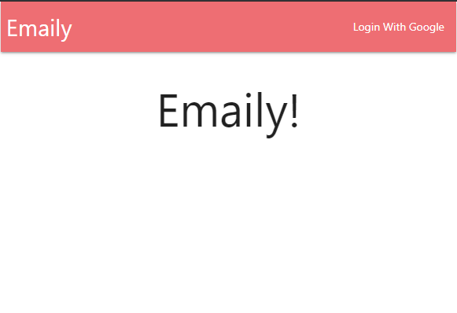
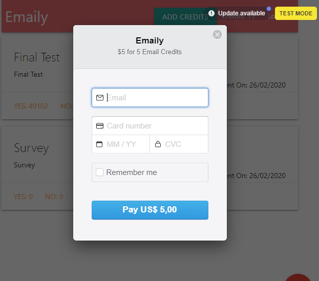
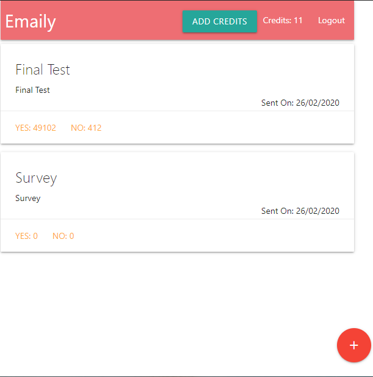
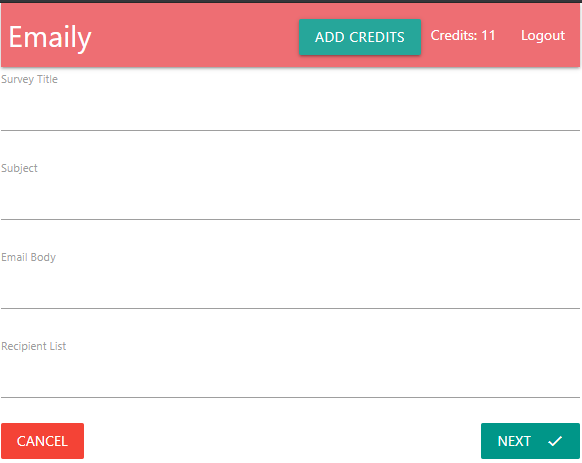
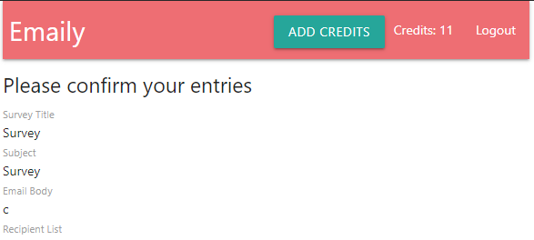

# Node with React: Fullstack Web Development

## About this Project

The idea of the App is:

_"Allow the user to create, delivery and verify surveys based on Udemy course ([Node with React: Fullstack Web Development](https://www.udemy.com/course/node-with-react-fullstack-web-development/))"._

## Why?

This project is part of my personal portfolio, so, I'll be happy if you could provide me any feedback about the project, code, structure or anything that you can report that could make me a better developer!

Email-me: harrisonhenrisn@gmail.com

Connect with me at [LinkedIn](https://linkedin.com/in/harrison-henri-dos-santos-nascimento-a6ba33112).

Also, you can use this Project as you wish, be for study, be for make improvements or earn money with it!

It's free!

## Functionalities

- Login with Google account



- Buy credits to be able to send your surveys



- Check the surveys created by you



- Write new surveys



- Confirm the information and send the surveys



## Install

Clone the repo using

```
$ git clone https://github.com/HarrisonHenri/FullStackReactNodejs
```

```
$ cd FullStackReactNodejs
```

Install all the required dependencies of server using (server directory)

```
$ npm install
```

Install all the required dependencies of client using (client directory)

```
$ npm install
```

In server directory, execute

```
$ npm run dev
```

## Demo

You can see the application working [here](https://mysterious-caverns-25456.herokuapp.com/).

## Built With

- [React](https://github.com/facebook/react) - Build the web app using JavaScript and React
- [Redux](https://redux.js.org/) - React State Manager
- [Redux-Form](https://github.com/redux-form/redux-form)
- [Redux-Thunk](https://github.com/reduxjs/redux-thunk)
- [Sendgrid](https://github.com/sendgrid/sendgrid-nodejs) - Email's sender
- [Stripe](https://github.com/stripe/stripe-node) - Billing
- [Router](https://github.com/ReactTraining/react-router) - Routers
- [Axios](https://github.com/axios/axios) - HTTP Client
- [Express](https://github.com/expressjs/express)
- [Mongoose](https://github.com/Automattic/mongoose) - ODM
- [Oauth20](https://github.com/jaredhanson/passport-google-oauth2) - Auth Client
- [Materialze](https://github.com/Dogfalo/materialize) - CSS Framework 

## Contributing

You can send how many PR's do you want, I'll be glad to analyse and accept them! And if you have any question about the project...

Email-me: harrisonhenrisn@gmail.com

Connect with me at [LinkedIn](https://linkedin.com/in/harrison-henri-dos-santos-nascimento-a6ba33112).

Thank you!
